# Computer Architecture: Lab 3
## Contributors
1. Full Name: Konstantinos Gerogiannis  
   Email: kostas.gerogiannis04@gmail.com  
   Github: [kostaGRG](https://github.com/kostaGRG/)  
2. Full Name: Katerina Vosniadou  
   Email: katerinavosn@gmail.com  
   Github: [katerinavos](https://github.com/katerinavos)
   
## Intro
This project is created for the university class named Computer Architecture at Aristotle University of Thessaloniki (AUTh). It's the third out of three repositories referenced on the same class.

## Part A
1. **Question 1** (Page 35, Chapter 8: Validation)

According to the technical report, the goal of creating McPat was the precise power modeling at the architectural level based on the timing criterion. This led to the selection of relative and absolute accuracy as evaluation metrics to verify its proper operation. Relative accuracy means that the relationship between architecture and power change in the simulation should be reflected in real conditions, while absolute accuracy is used to compare power thermal design power (TDP) limits or, more generally, for energy savings in the system.

The comparison of results from simulations was done with published data for each processor, along with the corresponding frequency and operating voltage. The configurations used for validation include data for clock rate, operating temperature, and architectural parameters.

Specifically, the processors used are:
* 90nm Niagara, with a frequency of 1.2GHz and a power supply of 1.2V,
* 65nm Niagara2, with a frequency of 1.4GHz and a power supply of 1.1V,
* 65nm Xeon, with a frequency of 3.4GHz and a power supply of 1.25V, and
* 180nm Alpha 21364, with a frequency of 1.2GHz and a power supply of 1.5V.

2. **Question 2** (Pages 7-8, Chapter 3.1: Power Modeling)

The above parameters pertain to the total power consumption of multi-core processors. This occurs because CMOS, which is described by these parameters, constitutes the structural elements of these processors. The relationship through which they affect the total power is shown in equation (2) of the McPat technical report:
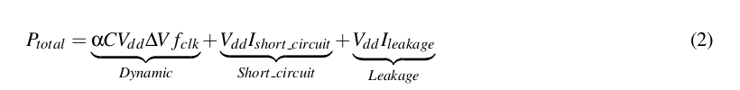

* dynamic power: The dynamic power consumed for charging and discharging capacitances when the circuit changes state, which depends on the program running each time.
* static power: The static power is due to leakage currents through the transistors, which act as "imperfect" switches between the source and the drain.
* short-circuit power: Short-circuit power is consumed when both pull-up and pull-down devices in a CMOS circuit are partially active for a short but finite period of time. Short-circuit power is usually 10% of dynamic power, but in some cases, it can reach up to 25% of dynamic power.
* leakage: The leakage current of transistors is due to physical causes, and the corresponding power consumption is constant for a given supply voltage (static power). Leakage current is proportional to the transistor's width, supply voltage, and depends on the logical state of the device. There are two leakage mechanisms. The first type of leakage is subthreshold leakage, which occurs when a transistor that is supposed to be in the off state allows a small current to pass between the source and drain. The second type of leakage is gate leakage, where the current leaks through the gate. In practice, leakage corresponds to the power consumption of the processor if absolutely no program was running and it was simply connected to power.
  
From the above, we can conclude that for different programs on the same processor, the aspect that will be affected is dynamic power. Since the program affects the number of accesses to caches and other elements of the architecture, which translate into transistor switches and, consequently, greater dynamic power losses.

The execution time of each program does not affect dynamic power, which depends solely on the capacitance of the transistor gate, the source voltage, and the switching frequency. Execution time only affects the total energy consumption in Joules. Obviously, a longer execution time means more energy consumption, but not power

3. **Question 3** 

As for energy efficiency, we can define it as the amount of energy that needs to be consumed/produced to perform a certain task. Thus, a system that accomplishes the same work with lower energy consumption is considered more energy-efficient. A longer battery life means that the system consumes less energy. Although processor 2 has higher power (35 W) compared to the first one (25 W), it may significantly outperform the other in terms of speed, which means that the total energy it consumes will be lower since E = P * t (E: energy, P: power, t: total time).

From the results of McPAT, we cannot answer the above question because neither the execution time nor the total energy used by each system appears anywhere, and for this purpose, we need a simulator like gem5.

4. **Question 4**

As indicated by the results of McPAT for the two processors, which are located in the "_results_" folder, and assuming that the processors operate at maximum power to complete the requested task as quickly as possible, we have the following values for the power consumed by each processor while they are operational:

||Xeon|ARM A9|
|:--:|:--:|:--:|
|Runtime Dynamic|72.9199 W|2.96053 W|
|Leakage|36.8319 W|0.10869 W|
|Total Power|109.7518 W|3.0692 W|

Therefore, assuming that the first processor takes τ seconds to complete the process, with a total energy cost of W1 = 109.7518τ J, the second processor will require 40τ seconds, which means it will consume energy equal to W2 = 122.768τ J, which initially appears to be higher. However, if the Xeon processor is not turned off immediately after completing the program execution, it will consume energy equal to the leakage power every second. This means that its total energy consumption will be much higher compared to the ARM A9.

So, the fact that a processor is faster does not automatically mean that it is more energy-efficient.

## Part B
To answer this question, we needed to rerun all the simulations conducted for the second laboratory, this time as input to McPAT.

1. **Question 1**

For these questions, we will need the values of area, delay, and energy. We can find the _area_ from the output of McPAT, the _delay_ is the total simulation time and can be found in the stats.txt file of gem5. Finally, the _energy_ value can be easily calculated from the product of power and simulation time. We can also directly find the energy using the script print_energy.py.

The total energy consumed can also be calculated using the formula: E = P * t, where P is the power losses (dynamic power and leakage power) and t is the simulation time. In other words, we have:

					E = (P[dynamic] + P[leakage]) * t    W
		E= (P[RuntimeDynamic] + P[Subthreshold Leakage] + P[Gate Leakage]) * t[Seconds Simulated]   W

2. **Question 2**

Below are graphs that depict the value of the energy-time-area product for various values of cache sizes, cache lines, and associativities. In the scatterplots, the value of the product obtained for the system with the optimal CPI that we calculated in the second laboratory is marked with a red line.

* **SPECLIBM**
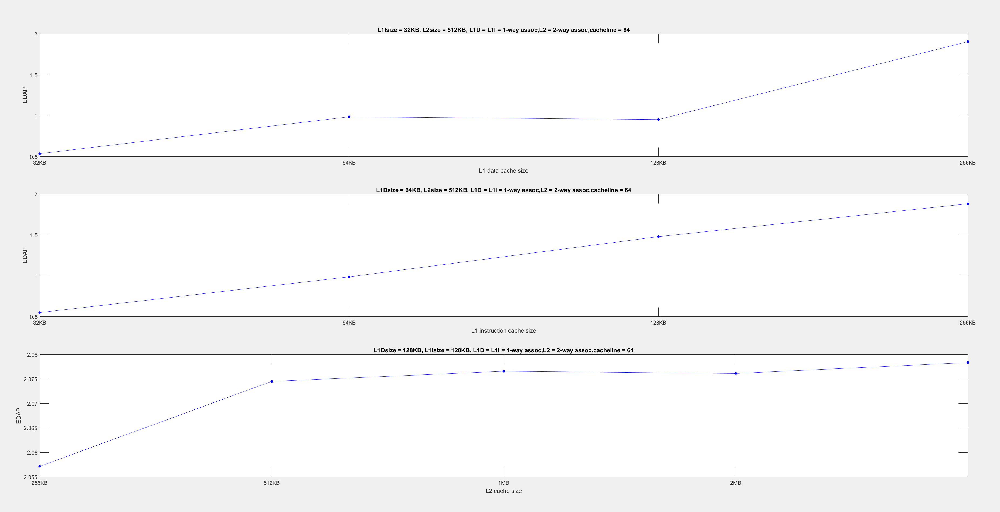
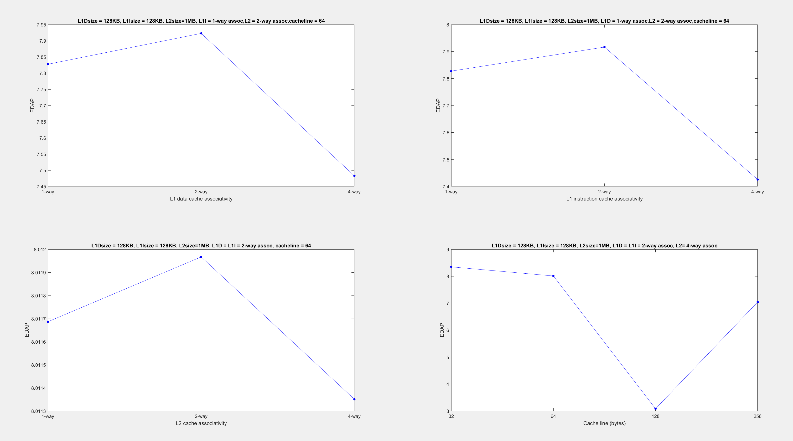
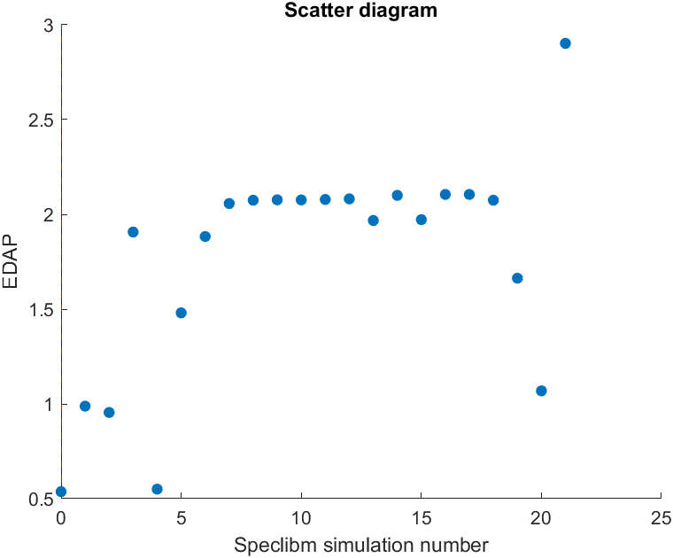

* **SPECSJENG**
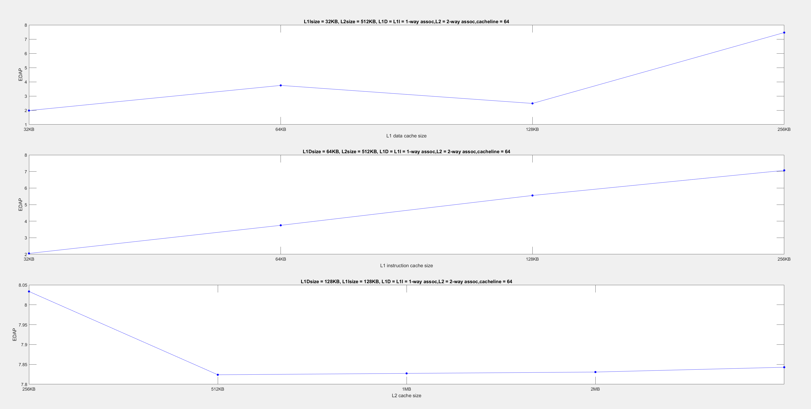
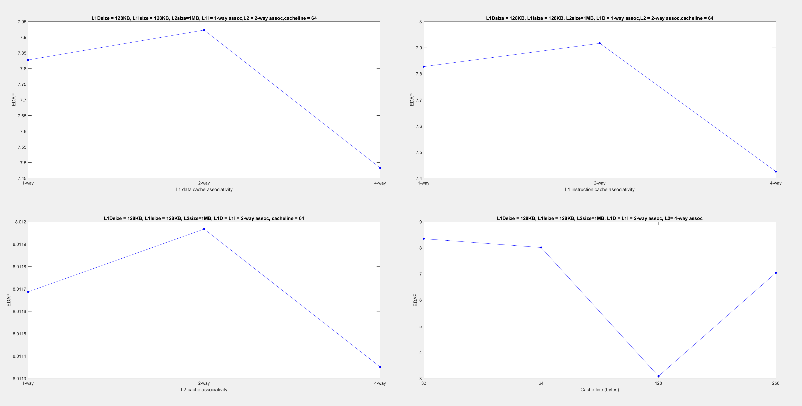
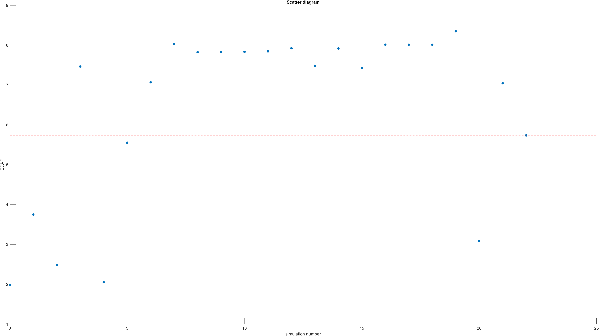

* **SPECMCF**
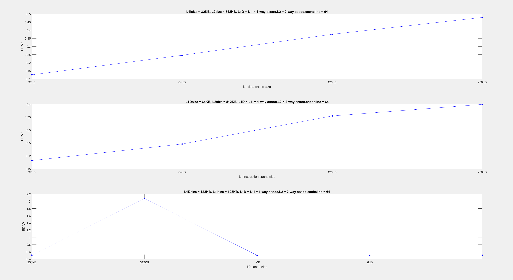
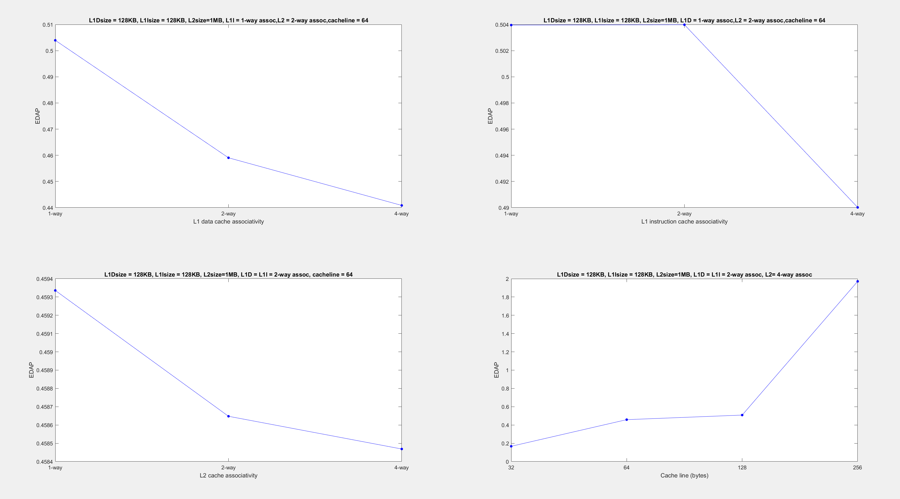
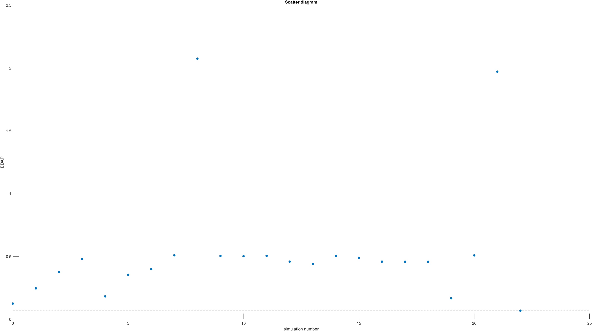

* **SPECBZIP**
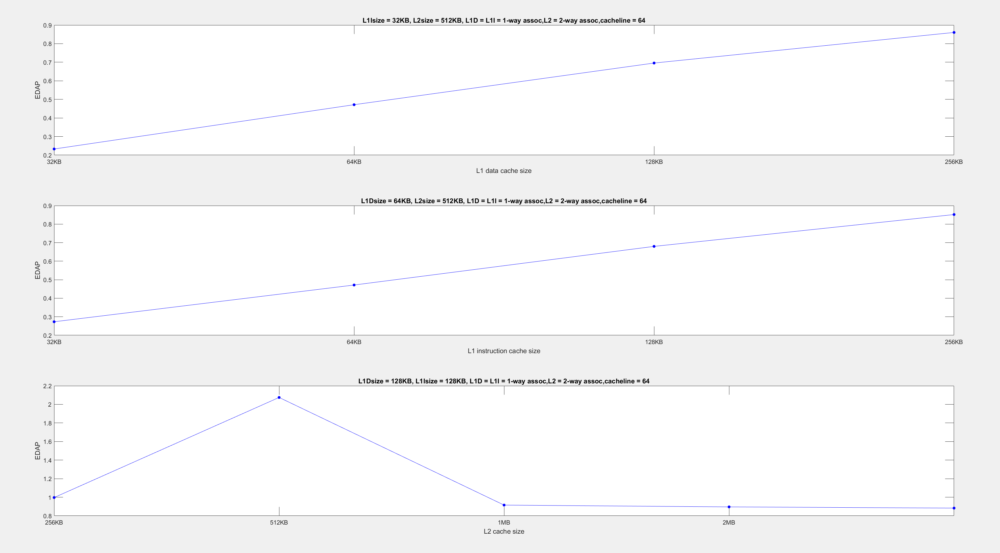
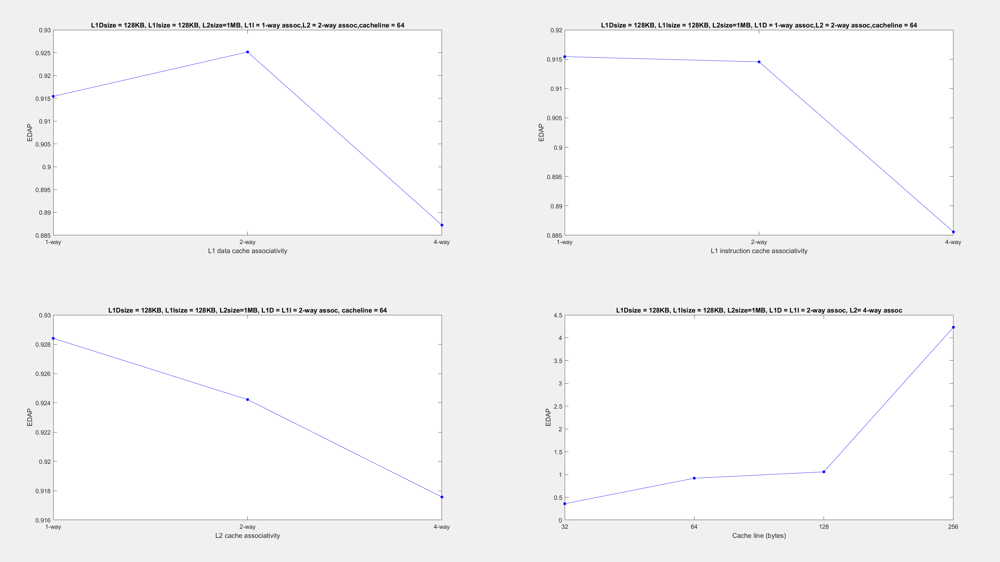
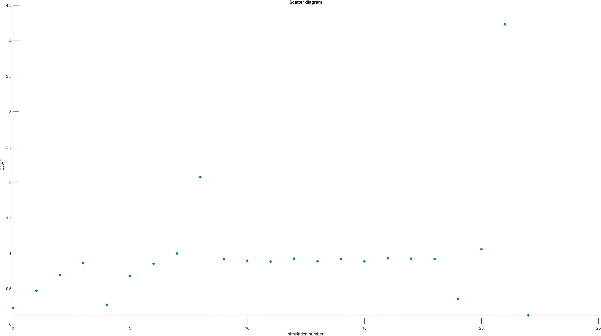

3. **Question 3**

We observe that peak power is influenced only by the different choices of architectural parameters (e.g., cache line size, associativity, etc.) for each processor, and not by the computational load of each benchmark. From the graphs, it is evident that the cache line size has the greatest impact on the final peak power. This is a cost-effective solution that significantly improves performance but incurs a high area cost, thereby increasing the EDAP. In the previous work, it reduced the cost function.

Power consumption is also affected by the size of the L1 cache, an option that is quite costly and does not significantly improve performance but greatly reduces EDAP by reducing both area and energy consumption.

The least influence is exerted by the associativity in the L1 and L2 caches, as well as the size of the L2 cache. The size of the L2 cache does not affect power consumption to the same extent as the L1 cache because the L2 cache is only activated when the L1 misses. Therefore, although the L2 cache is more power-hungry per lookup than the L1 due to its size, it receives fewer requests, resulting in lower energy costs.

In conclusion, our results are quite different, and as computer architects, we need to consider different parameters depending on the specific requirements.

## References
[Energy efficiency](https://www.ovoenergy.com/guides/energy-guides/what-is-energy-efficiency?fbclid=IwAR2r1Mbxy128LRFSveaeW6ub5_nb95zvRxHTBiiWWg_a31TdYT6JOIIhTTQ)  
[McPAT official website](http://www.hpl.hp.com/research/mcpat/)  

## Review
The third laboratory helped us significantly in understanding the relationship between the energy consumption and performance of a processor. Both the structured questions and the relevant literature, as well as our experience from the previous laboratory, helped us better comprehend the exercise and complete it much more quickly than the previous one. This was also influenced by the time required for each simulation (2-3 minutes), which was significantly shorter than in the previous work, where each benchmark required about 15 minutes.

Overall, through our engagement with all three laboratories, we have found that the design of architecture is a highly multi-factorial process. There is always a trade-off between the design parameters of a processor, so the choice of features depends on the needs of the problem at hand.
