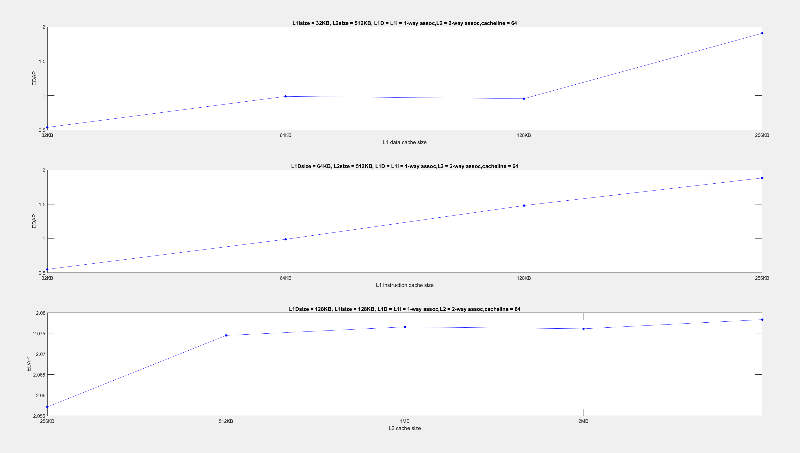
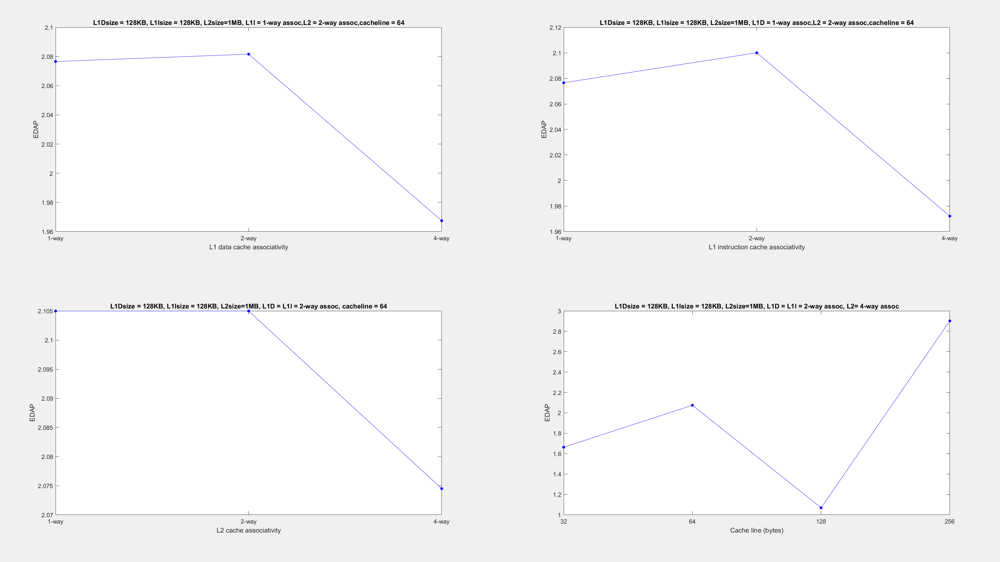
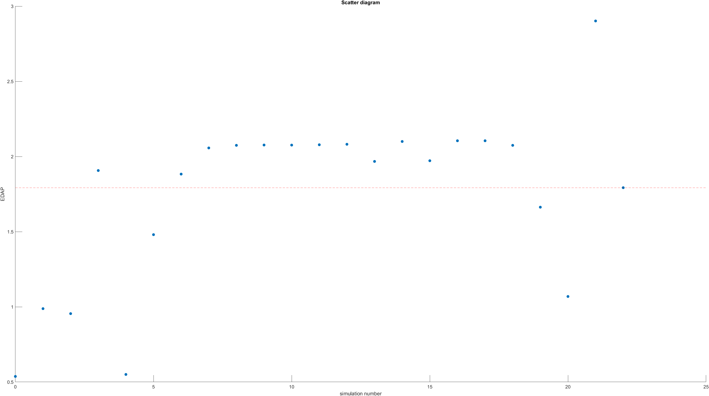

### Computer Architecture: Lab 3

#### Γενικά
Παρακάτω ακολουθεί η αναφορά της εργασίας του τρίτου εργαστηρίου του μαθήματος Αρχιτεκτονική Υπολογιστών, που ασχολείται με το πρόγραμμα McPAT.

#### Μέρος 1
1. **ΕΡΩΤΗΜΑ 1** (Σελίδα 35, Ενότητα 8: Validation, παράγραφοι 1-2)

Σύμφωνα με την τεχνική αναφορά, στόχος της δημιουργίας του McPat ήταν η ακριβής μοντελοποίηση ισχύος σε αρχιτεκτονικό επίπεδο με βάση το κριτήριο του χρονισμού. Αυτό οδήγησε στην επιλογή της σχετικής και απόλυτης ακρίβειας ως μετρικές αξιολόγησης για την επικύρωση της καλής λειτουργίας του. Η σχετική ακρίβεια σημαίνει ότι η σχέση μεταξύ της αρχιτεκτονικής και της μεταβολή ισχύος στην προσωμοίωση, θα πρέπει να αντικατοπτρίζεται και σε πραγματικές συνθήκες, ενώ, η απόλυτη ακρίβεια χρησιμοποιείται για σύγκριση των ορίων ισχύος θερμικής σχεδίασης (TDP) ή γενικότερα για εξοικονόμηση ενέργειας στο σύστημα.
Η σύγκριση των αποτελεσμάτων από τις προσωμοιώσεις έγινε με δημοσιευμένα δεδομένα για κάθε επεξεργαστή και την αντίστοιχη συχνότητα και τάση λειτουργίας του. Τα configurations που χρησιμοποιήθηκαν για το validation περιλαμβάνουν δεδομένα για τον ρυθμό ρολογιού, τη θερμοκρασία λειτουργίας και τις αρχιτεκτονικές παραμέτρους.
Συγκεκριμένα, οι επεξεργαστές που χρησιμοποιήθηκαν είναι οι:
* 90nm Niagara, με συχνότητα 1.2GHz και παροχή ενέργειας 1.2V,
* 65nm Niagara2, με συχνότητα 1.4GHz και παροχή ενέργειας 1.1V,
* 65nm Xeon, με συχνότητα 3.4GHz και παροχή ενέργειας 1.25V και
* 180nm Alpha 21364, με συχνότητα 1.2GHz και παροχή ενέργειας 1.5V.

2. **ΕΡΩΤΗΜΑ 2** (Σελίδα 7-8, Ενότητα 3.1: Power Modeling)

Οι παραπάνω παράμετροι αφορούν τη συνολική κατανάλωση ισχύος των πολυπήρηνων επεξεργαστών. Αυτό συμβαίνει διότι τα CMOS, τα οποία περιγράφονται από αυτές τις παραμέτρους, αποτελούν δομικά στοιχεία αυτών των επεξεργαστών. Η σχέση με την οποία επιδρούν στη συνολική ισχύ φαίνεται στην εξίσωση (2) της τεχνικής αναφοράς του McPat:

* dynamic power: Η δυναμική ισχύς που καταναλίσκεται για τη φόρτιση και εκφόρτιση των χωρητικοτήτων, όταν το κύκλωμα αλλάζει κατάσταση, το οποίο εξαρτάται από το πρόγραμμα που τρέχει κάθε φορά. 
* static power: Η στατική ισχύς που οφείλεται στα ρεύματα διαρροής μέσω των τρανζίστορ, τα οποία λειτουργούν ως "ατελείς" διακόπτες μεταξύ του source και του drain.
* short-circuit power: Η ισχύς βραχυκυκλώματος καταναλώνεται όταν τόσο οι συσκευές pull-up όσο και οι pull-down σε ένα κύκλωμα CMOS, είναι μερικώς ενεργοποιημένες για μικρό, αλλά πεπερασμένο χρονικό διάστημα. Η ισχύς βραχυκυκλώματος συνήθως είναι το 10% της δυναμικής ισχύος, ενώ σε μερικές περιπτώσεις μπορεί να φτάσει και το 25% της δυναμικής ισχύος. 
* leakage: Το ρεύμα διαρροής των τρανζίστορ οφείλεται σε φυσικά αίτια και η αντίστοιχη κατανάλωση ισχύος είναι σταθερή για μια δεδομένη τιμή τάσης τροφοδοσίας (στατική ισχύς). Το ρεύμα διαρροής είναι ανάλογο με το πλάτος του τρανζίστορ, την τάση τροφοδοσίας και εξαρτάται από τη λογική κατάσταση της συσκευής. Υπάρχουν δύο μηχανισμοί διαρροής. Ο πρώτος τύπος διαρροής είναι η διαρροή υποκατωφλίου, η οποία προκύπτει όταν ένα τρανζίστορ, που υποτίθεται ότι είναι σε κατάσταση απενεργοποίησης, επιτρέπει στην πραγματικότητα να περάσει ένα μικρό ρεύμα μεταξύ του source και του drain. Ο δεύτερος τύπος διαρροής είναι η διαρροή πύλης, όπου το ρεύμα διαρρέει το gate.  Πρακτικά το leakage αντιστοιχεί την κατανάλωση ισχύος του επεξεργαστή αν δεν έτρεχε κανένα απολύτως πρόγραμμα και ήταν απλά συνδεδεμένος στο ρεύμα. 

Από τα παραπάνω, μπορούμε να συμπεράνουμε ότι για διαφορετικά προγράμματα στον ίδιο επεξεργαστή, το μέγεθος που θα επηρεαστεί είναι το dynamic power. Αφού το πρόγραμμα επηρεάζει το πλήθος των προσβάσεων (accesses) στις caches και σε άλλα στοιχεία της αρχιτεκτονικής, τα οποία μεταφράζονται σε μεταγωγές στα τρανζίστορ και συνεπώς σε μεγαλύτερες απώλειες δυναμικής ισχύος.

Ο χρόνος εκτέλεσης κάθε προγράμματος δεν επηρεάζει το dynamic power, το οποίο εξαρτάται αποκλειστικά από τη χωρητικότητα της πύλης των transistor, την τάση της πηγής και τη συχνότητα αλλαγής (switching frequency). Ο χρόνος εκτέλεσης επηρεάζει μόνο τη συνολική κατανάλωση ενέργειας σε Joule. Προφανώς, μεγαλύτερος χρόνος εκτέλεσης σημαίνει περισσότερη κατανάλωση ενέργειας, όχι όμως ισχύος.

3. **ΕΡΩΤΗΜΑ 3** 

Ως energy efficiency ( ενεργειακή απόδοση ) μπορούμε να ορίσουμε το ποσό της ενέργειας που πρέπει να καταναλωθεί/αποδοθεί ώστε να πραγματοποιηθεί μία ενέργεια. Έτσι ένα σύστημα που επιτυγχάνει την ίδια δουλειά με μικρότερη κατανάλωση ενέργειας θεωρείται ενεργειακά αποδοτικότερο. Μεγαλύτερη διάρκεια μπαταρίας σημαίνει πως το σύστημα καταναλώνει λιγότερη ενέργεια. Παρόλο που ο επεξεργαστής 2 έχει μεγαλύτερη ισχύ (35 W) συγκριτικά με τον πρώτο (25 W), μπορεί να υπερτερεί σημαντικά σε ταχύτητα έναντι του άλλου, κάτι που σημαίνει ότι η συνολική ενέργεια που καταναλώνει θα είναι μικρότερη, αφού E=P*t(E: ενέργεια, P: ισχύς, t:συνολικός χρόνος).  
Από τα αποτελέσματα του McPAT δεν μπορούμε να απαντήσουμε στο παραπάνω ερώτημα διότι δεν εμφανίζεται πουθενά είτε ο χρόνος εκτέλεσης είτε η συνολική ενέργεια που χρειάστηκε το κάθε σύστημα και για τον σκοπό αυτό χρειαζόμαστε έναν προσομοιωτή όπως είναι ο gem5.

4. **ΕΡΩΤΗΜΑ 4**

Όπως προκύπτει από τα αποτελέσματα του McPAT για τους δύο επεξεργαστές, τα οποία βρίσκονται στον φάκελο _results_, και υποθέτοντας πως οι επεξεργαστές λειτουργούν στη μέγιστη ισχύ για να διεκπεραιώσουν όσο το δυνατόν πιο γρήγορα την διεργασία που τους ζητείται, έχουμε τις εξής τιμές για την ισχύ που καταναλώνει ο κάθε επεξεργαστής όσο λειτουργούν:

||Xeon|ARM A9|
|:--:|:--:|:--:|
|Runtime Dynamic|72.9199 W|2.96053 W|
|Leakage|36.8319 W|0.10869 W|
|Total Power|109.7518 W|3.0692 W|

Επομένως, με την υπόθεση ότι ο πρώτος επεξεργαστής θα κάνει τ δευτερόλεπτα για να εκτελέσει την διεργασία, με συνολικό ενεργειακό κόστος W1 = 109.7518τ J, ο δεύτερος επεξεργαστής θα χρειαστεί 40τ δευτερόλεπτα, δηλαδή θα καταναλώσει ενέργεια ίση με W2 = 122.768τ J, που εκ πρώτης όψεως φαίνεται μεγαλύτερη. Αν όμως δεν απενεργοποιηθεί ο Xeon με το που τελειώσει την εκτέλεση του προγράμματος, τότε θα καταναλώνει κάθε δευτερόλεπτο ενέργεια ίση με την ισχύ leakage, που σημαίνει πως η συνολική ενέργεια του θα είναι πολύ μεγαλύτερη συγκριτικά με αυτήν του ARM A9.
Άρα το γεγονός πως ένας επεξεργαστής είναι πιο γρήγορος δε σημαίνει αυτόματα πως είναι και ενεργειακά αποδοτικότερος.

#### Μέρος 2
Για το ερώτημα αυτό χρειάστηκε να τρέξουμε ξανά όλες τις προσομοιώσεις που πραγματοποιήθηκαν για το δεύτερο εργαστήριο, αυτή τη φορά ως είσοδο στο McPAT.

1. **ΕΡΩΤΗΜΑ 1**

Για αυτά τα ερωτήματα θα χρειαστούμε τις τιμές των area, delay και energy. Την _area_ την βρίσκουμε από την έξοδο του McPAT, το _delay_ είναι ο συνολικός χρόνος της προσομοίωσης και θα βρεθεί από το αρχείο stats.txt του gem5. Τέλος, η τιμή _energy_ μπορεί να υπολογισθεί εύκολα από το γινόμενο ισχύος με χρόνου προσομοίωσης. Την ενέργεια μπορούμε να την βρούμε απευθείας και από το script print_energy.py  
Η συνολική ενέργεια που καταναλώθηκε μπορεί να βρεθεί και από τον τύπο: Ε = P * t, οπου P οι απώλειες ισχύος (δυναμική ισχύς και ισχύ διαρροής) και t ο χρόνος της προσωμοίωσης. Δηλαδή έχουμε: 

					E = (P[dynamic] + P[leakage]) * t    W
		E= (P[RuntimeDynamic] + P[Subthreshold Leakage] + P[Gate Leakage]) * t[Seconds Simulated]   W

2. **ΕΡΩΤΗΜΑ 2**

Ακολουθούν γραφήματα που απεικονίζουν την τιμή του γινομένου ενέργειας-χρόνου-περιοχής για διάφορες τιμές των cache sizes, cache lines και associativities.

* **SPECLIBM**

* **SPECSJENG**

* **SPECMCF**

* **SPECBZIP**

3. **ΕΡΩΤΗΜΑ 3**

Παρατηρούμε ότι το peak power επηρεάζεται μόνο από τις διαφορετικές επιλογές των αρχιτεκτονικών παραμέτρων (πχ. cache line size, associativity κλπ.) για κάθε επεξεργαστή, και όχι από τον υπολογιστικό φόρτο κάθε benchmark. Από τα γραφήματα φαίνεται ότι τη μεγαλύτερη επιρροή στο τελικό peak power έχει το μέγεθος γραμμής της cache, το οποίο είναι μια φθηνή λύση που αυξάνει αρκετά την απόδοση αλλά κοστίζει πάρα πολύ σε area, άρα αυξάνει το EDAP ένω, στην προηγούμενη εργασία μείωνε τη συνάρτηση κόστους. Η κατανάλωση επηρεάζεται και από το μέγεθος της L1 cache, μια επιλογή που κόστιζε αρκετά και δεν βελτίωνε ιδιαίτερα την απόδοση αλλά μικραίνει πολύ το EDAP καθώς μειώνει αρκετά το Area αλλά και την καταναλισκόμενη ενέργεια.  
Τη μικρότερη επιρροή όλων έχει το associativity στις L1 και L2 caches καθώς και το μέγεθος της L2 cache. Το μέγεθος της L2 δεν επηρεάζει την κατανάλωση στον ίδιο βαθμό με αυτόν της L1 διότι L2, αν και μεγαλύτερη μνήμη θα σήμαινε περισσότερο χρόνο (άρα και ενέργεια), ωστόσο ενεργοποιείται μόνο όταν η L1 έχει miss. Συνεπώς, παρόλο που L2 είναι πιο ενεργοβόρα ανά lookup από την L1 λόγω μεγέθους, δε δέχεται τον ίδιο αριθμό αιτήσεων, με αποτέλεσμα να έχει μικρότερο ενεργειακό κόστος.  
Καταλήγουμε λοιπόν πως τα αποτελέσματα μας είναι αρκετά διαφορετικά και πρέπει ως αρχιτέκτονες υπολογιστών να λαμβάνουμε υπ'όψιν διαφορετικές παραμέτρους ανάλογα με τις εκάστοτε απαιτήσεις.

#### Πηγές
[Energy efficiency](https://www.ovoenergy.com/guides/energy-guides/what-is-energy-efficiency?fbclid=IwAR2r1Mbxy128LRFSveaeW6ub5_nb95zvRxHTBiiWWg_a31TdYT6JOIIhTTQ)  
[McPAT official website](http://www.hpl.hp.com/research/mcpat/)  

#### Στοιχεία φοιτητών
1. Ονοματεπώνυμο: Κωνσταντίνος Γερογιάννης  
   Email: konsgero@ece.auth.gr  
   Github: [kostaGRG](https://github.com/kostaGRG/)  
2. Ονοματεπώνυμο: Κατερίνα Βοσνιάδου  
   Email: katerinavos@gmail.com  
   Github: [katerinavos](https://github.com/katerinavos_)

